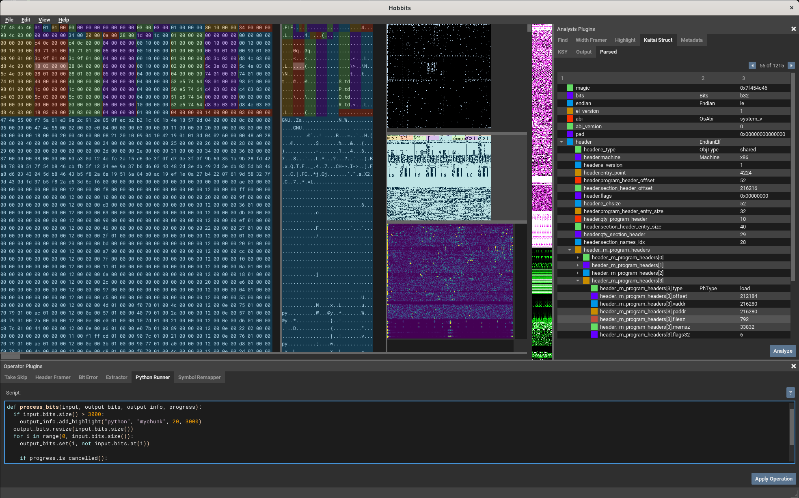

## About
Hobbits was developed at Mahlet in 2019 as an integrated data analysis tool. It was open-sourced
and is now (passively) maintained anyone who wants to contribute. 

## Building from source

1. Install the required build tools and development libraries.

Ubuntu 22.04 LTS example:
```
sudo apt-get install -y patchelf libusb-1.0-0-dev libpcap-dev qtbase5-dev qtchooser qt5-qmake qtbase5-dev-tools python3-dev ninja-build cmake g++
```

2. Build with CMake
```
cmake -G Ninja -B build .
cmake --build build
```

If building using the bundled pffft, ensure you clone or checkout with the
`--recurse-submodules` flag.


